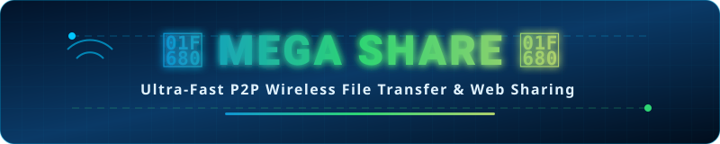

<div align="center">

<!-- Animated Shields & Badges -->
<p align="center">
  <a href="./MEGA-SHARE.apk">
    
  </a>
  
  
  
  <a href="https://github.com/rahulae1616-rgb/MEGA-SHARE">
    
  </a>
</p>

<br>

<!-- Live Animated Title Banner Image -->
<a href="https://github.com/rahulae1616-rgb/MEGA-SHARE">
  
</a>

<br>
<br>

> ⚡ **MEGA SHARE** turns your Android device into a hyper-fast local HTTP & P2P file server! Transfer massive video files, photo albums, apps, and documents between phones, laptops, and PCs at max Wi-Fi speeds — **no cables, no cloud limits, and zero internet required!**

</div>

---

## 🎁 Grab The App Now!

> [!IMPORTANT]
> ### 📱 Download MEGA SHARE directly to your phone:
>
> <div align="center">
> 
> # **👇 [CLICK HERE TO DOWNLOAD MEGA-SHARE.apk](./MEGA-SHARE.apk) 👇**
> 
> </div>
>
> *(After downloading, tap `MEGA-SHARE.apk` to install! Make sure **"Install from unknown sources"** is enabled in Android settings).* ⚡

---

## ✨ Key Features

- 📶 **Zero Internet Needed:** Share files even when internet connection is down. Works over local Wi-Fi or Mobile Hotspot!
- ⚡ **Gigabit Wi-Fi Speeds:** Transfer files at the full physical speed of your Wi-Fi router (up to 50MB/s+).
- 💻 **Cross-Platform PC Access:** Send files to any Windows, Mac, Linux, or iOS browser via QR code or local URL.
- 🔒 **End-To-End Local Security:** Files stay inside your home/office network without touching third-party cloud servers.
- 📂 **No File Size Restrictions:** Send 100GB+ videos, zip archives, or raw photo batches effortlessly.

---

## 📲 How It Works

```
┌─────────────────┐      Local Wi-Fi / Hotspot      ┌─────────────────┐
│                 │ ──────────────────────────────> │                 │
│  Android App    │   Fast HTTP P2P Transfer Stream  │  PC / Phone /   │
│  (MEGA SHARE)   │ <────────────────────────────── │     Browser     │
└─────────────────┘                                 └─────────────────┘
```

1. Launch **MEGA SHARE** on your phone.
2. Select the files, photos, or videos you wish to share.
3. Open the provided web link or scan the QR code on any receiving device connected to the same Wi-Fi.
4. Download files at maximum router speed!

---

## 📱 Specifications

| Parameter | Specification |
| :--- | :--- |
| **File Name** | `MEGA-SHARE.apk` |
| **Size** | ~30 MB |
| **Protocol** | Local HTTP Web Server / Direct P2P |
| **Supported Receivers** | Any Browser (Chrome, Safari, Edge, Firefox, Mobile Browsers) |

---

## 👨‍💻 Author

Developed by **RAHUL CHANDRA**
- 🐙 **GitHub:** [@rahulae1616-rgb](https://github.com/rahulae1616-rgb)

---

## 📜 License

Distributed under the **MIT License**.
